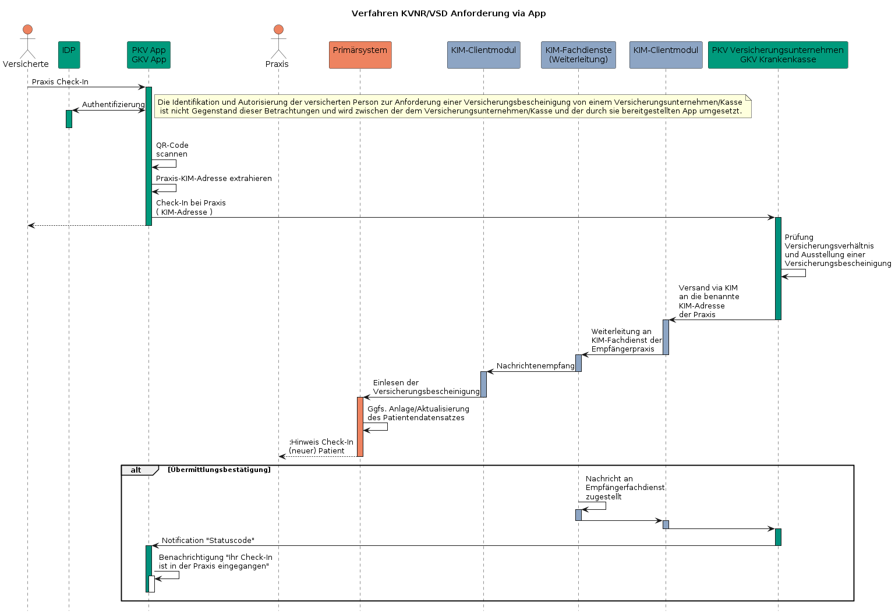

# Inhalt

- [Inhalt](#inhalt)
  - [UseCase und Funktionsweise (GKV-Versicherte)](#usecase-und-funktionsweise-gkv-versicherte)
  - [UseCase und Funktionsweise (PKV-Versicherte)](#usecase-und-funktionsweise-pkv-versicherte)

## UseCase und Funktionsweise (GKV-Versicherte)

## UseCase und Funktionsweise (PKV-Versicherte)

